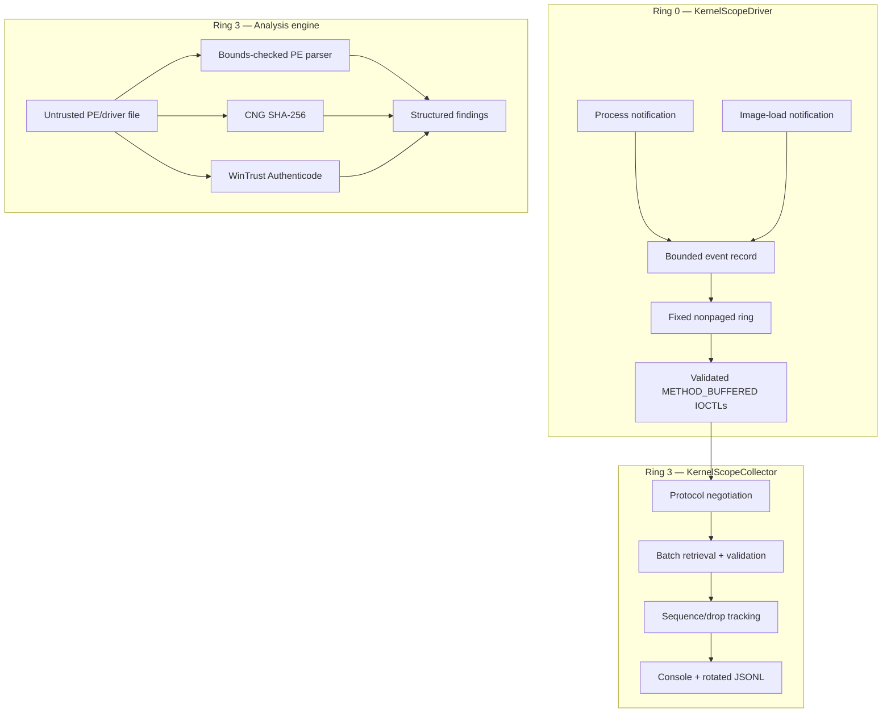

<div align="center">

# KernelScope

**Defensive Windows Kernel Telemetry and Driver Integrity Platform**

[](#requirements)
[](#architecture)
[](#repository-layout)
[](#security-boundary)
[](LICENSE)
[](https://github.com/YasayanEfsane/KernelScope/actions/workflows/ci.yml)
[](https://github.com/YasayanEfsane/KernelScope/actions/workflows/wdk-driver.yml)
[](https://github.com/YasayanEfsane/KernelScope/actions/workflows/codeql.yml)

KernelScope is a portfolio-grade, educational Windows security project that
collects bounded kernel telemetry, transports it through a hardened protocol,
and performs PE/COFF, SHA-256, and Authenticode analysis in user mode.

</div>

> [!IMPORTANT]
> KernelScope is strictly defensive and intended for authorized research in a
> disposable, isolated Windows virtual machine. It is not an EDR, anti-cheat,
> rootkit, bypass framework, or production security boundary.

> [!WARNING]
> Kernel drivers can crash or prevent a system from booting. Take a VM snapshot,
> keep recovery access available, and read the [testing safety guide](docs/TESTING.md)
> before loading the driver. Driver Verifier is never enabled automatically.

## Table of contents

- [Why KernelScope](#why-kernelscope)
- [Project status](#project-status)
- [Capabilities](#capabilities)
- [Security boundary](#security-boundary)
- [Architecture](#architecture)
- [Telemetry model](#telemetry-model)
- [Protocol overview](#protocol-overview)
- [Requirements](#requirements)
- [Quick start](#quick-start)
- [Build](#build)
- [Driver signing and installation](#driver-signing-and-installation)
- [Collector commands](#collector-commands)
- [Analysis engine](#analysis-engine)
- [JSONL output](#jsonl-output)
- [Testing and quality gates](#testing-and-quality-gates)
- [Repository layout](#repository-layout)
- [Documentation](#documentation)
- [Troubleshooting](#troubleshooting)
- [Limitations](#limitations)
- [Roadmap](#roadmap)
- [Contributing and support](#contributing-and-support)
- [License](#license)

## Why KernelScope

Windows kernel projects often fail in one of two directions: they are too small
to demonstrate realistic engineering, or they rely on unsafe and unsupported
techniques. KernelScope takes a different route. It demonstrates defensive
kernel development while keeping the trust boundary narrow and reviewable.

The project is built around four principles:

1. **Documented APIs only.** Telemetry uses supported process and image-load
   notification APIs instead of hooks or kernel patching.
2. **Minimal Ring 0 work.** Callbacks copy bounded metadata into preallocated
   nonpaged storage and return quickly.
3. **Strict protocol validation.** Kernel and user mode share a versioned,
   pointer-free ABI with exact sizes, reserved fields, and compile-time checks.
4. **Heavy work in Ring 3.** File I/O, hashing, trust verification, PE parsing,
   UTF conversion, JSON serialization, and reporting stay in user mode.

## Project status

| Area | Status | Notes |
| --- | --- | --- |
| Shared protocol v1 | Implemented | Fixed-width ABI, exact validation, compile-time layout assertions |
| KMDF control driver | Implemented | Non-PnP control device, secure SDDL, buffered IOCTL queue |
| Process telemetry | Implemented | Create and exit notifications |
| Image telemetry | Implemented | Executable, DLL, and kernel-driver image classifications |
| Bounded ring buffer | Implemented | 1,024 fixed records, sequence gaps, saturating drop accounting |
| Collector | Implemented | Negotiation, validation, console output, JSONL, rotation, Ctrl+C |
| PE/COFF analyzer | Implemented | Bounds-checked headers, sections, directories, entropy, findings |
| Integrity checks | Implemented | SHA-256 through CNG and Authenticode through WinTrust |
| Offline tests | Implemented | Protocol, parser, hashing, JSON, and sequence tracking |
| VM integration suite | Implemented | Optional negative protocol and driver lifecycle checks |
| Hosted CI | Implemented | User-mode tests and CodeQL, pinned WDK builds, driver CodeQL, Universal INF verification |
| Production support | Not claimed | Independent review, signing, and Windows validation are still required |

The exact validation performed for this source delivery is recorded in
[`docs/VALIDATION.md`](docs/VALIDATION.md). A successful WDK workflow proves
that the driver project compiled and its stamped INF passed `InfVerif /u` with
the pinned toolchain. It does not prove driver loading or kernel runtime safety.

## Capabilities

### Kernel telemetry

- Process creation and exit events through documented callbacks.
- Executable, DLL, and kernel-driver image-load events.
- Monotonic 64-bit sequence numbers and explicit gap detection.
- Fixed-capacity, `NonPagedPoolNx` storage allocated during initialization.
- Saturating drop counters and synthetic dropped-event records.
- Secure cleanup and callback removal before driver unload.

### User-mode collection

- Protocol negotiation before any telemetry request.
- Independent validation of every response and event record.
- Least-privilege device opens based on the requested operation.
- Human-readable UTF-8 console output.
- Newline-delimited JSON with configurable size-based rotation.
- Graceful Ctrl+C cancellation and meaningful exit codes.

### Driver and PE analysis

- DOS, NT, file, optional, and section header analysis.
- Checked RVA-to-file-offset translation without memory mapping.
- Imports, exports, relocations, TLS, debug/PDB, load configuration,
  exception data, and certificate table inspection.
- Overlap, truncation, range, arithmetic, and malformed-directory findings.
- Writable-executable section and entry-point permission checks.
- Section entropy and missing mitigation declarations.
- SHA-256 with Windows CNG.
- Authenticode verification with explicit valid, invalid, unsigned,
  revocation-unknown, and verification-error states.

## Security boundary

KernelScope deliberately does **not** implement or recommend:

- SSDT, IDT, syscall, import, or inline hooking;
- kernel patching or executable-memory modification;
- PatchGuard, HVCI, DSE, Secure Boot, or signature bypasses;
- arbitrary kernel or process memory reading or writing;
- process, thread, file, driver, or network-object hiding;
- credential collection, persistence, stealth, or evasion;
- undocumented kernel structures or unsupported APIs;
- anti-cheat or EDR bypass behavior.

The primary security invariants are:

| Invariant | Enforcement |
| --- | --- |
| Only SYSTEM and Administrators can open the device | `SDDL_DEVOBJ_SYS_ALL_ADM_ALL` and `FILE_DEVICE_SECURE_OPEN` |
| Reset requires stronger access than collection | Reset IOCTL uses `FILE_WRITE_DATA`; telemetry uses `FILE_READ_DATA` |
| No user pointer reaches driver logic | Every IOCTL uses `METHOD_BUFFERED` |
| Protocol layouts are architecture-stable | Fixed-width fields, fixed arrays, packing and static assertions |
| Malformed messages fail closed | Exact lengths, version/type/flag checks, zero-required reserved fields |
| Failures disclose no partial output | Failed IOCTLs complete with zero output bytes |
| Notification callbacks remain bounded | No callback-time allocation, hashing, file I/O, trust lookup, or JSON |
| Ring 0 memory is non-executable | `NonPagedPoolNx`; no dynamic code or executable allocation |
| Event overload is visible | Drop totals, synthetic drop records, and sequence gaps |
| Untrusted PE bytes are never mapped as an image | Ordinary file reads and checked range/RVA conversions |

Read the full [threat model](docs/THREAT_MODEL.md),
[architecture analysis](docs/ARCHITECTURE.md), and
[hardening checklist](docs/HARDENING.md) before changing a trust boundary.

## Architecture



The driver and collector communicate through `\\.\KernelScope`. The driver is
a non-PnP KMDF control driver with an on-demand kernel service. The collector is
a Unicode C++17 console application. The analyzer is compiled into the collector
and never executes inside the kernel.

## Telemetry model

| Event | Source | Key fields |
| --- | --- | --- |
| `process_create` | Process notification callback | PID, parent PID, bounded image path |
| `process_exit` | Process notification callback | PID, timestamp |
| `executable_image_load` | Image-load callback | PID, image base, image size, path |
| `dll_image_load` | Image-load callback | PID, image base, image size, path |
| `kernel_driver_image_load` | Image-load callback | image base, image size, path, system flag |
| `dropped_event_statistics` | Ring-buffer recovery path | pending drop count in `AuxiliaryValue` |

Each record is exactly 600 bytes. Paths are bounded to 259 UTF-16 characters
plus a NUL terminator. Truncation is explicit. Classification is derived only
from documented callback metadata and a bounded `.exe` suffix heuristic; it is
telemetry, not a security verdict.

## Protocol overview

The version 1 protocol lives in [`shared/Protocol.h`](shared/Protocol.h) and is
described field-by-field in [`docs/PROTOCOL.md`](docs/PROTOCOL.md).

| IOCTL | Access | Request | Response |
| --- | --- | --- | --- |
| `KS_IOCTL_QUERY_PROTOCOL` | Read | 32-byte query | 64-byte capabilities response |
| `KS_IOCTL_GET_EVENTS` | Read | 40-byte bounded request | `64 + N × 600` bytes, `1 <= N <= 64` |
| `KS_IOCTL_GET_STATISTICS` | Read | 32-byte request | 80-byte statistics response |
| `KS_IOCTL_RESET_STATISTICS` | Write | 48-byte reset request | 80-byte statistics response |

All protocol structures contain fixed-width values only. They contain no
pointers, handles, `size_t`, flexible arrays, native-width fields, bitfields,
or architecture-dependent enums.

## Requirements

- Windows 10 or Windows 11 x64 in an isolated test VM.
- Visual Studio 2022 (17.x) for parity with the pinned WDK 26100 toolchain.
- **Desktop development with C++** workload.
- Windows SDK and WDK 10.0.26100.6584, or another documented compatible pair.
- Administrator access inside the VM.
- A snapshot and tested recovery path before driver installation.

The project targets the KMDF 1.15 ABI because the implementation does not need
later framework features and is intended for Windows 10/11. Do not change the
KMDF target without checking the supported-OS matrix and retesting all targets.

## Quick start

The safest first run uses only the user-mode parser and offline tests:

```powershell
# Open a Developer PowerShell in the extracted or cloned repository.
Set-Location C:\src\KernelScope

msbuild .\collector\KernelScopeCollector.vcxproj `
  /m /p:Configuration=Release /p:Platform=x64

msbuild .\tests\KernelScopeTests.vcxproj `
  /m /p:Configuration=Release /p:Platform=x64

.\tests\x64\Release\KernelScopeTests.exe
.\collector\x64\Release\KernelScopeCollector.exe `
  analyze C:\Windows\System32\drivers\example.sys
```

Driver loading is a separate, elevated VM-only step.

## Build

### Visual Studio

1. Open `KernelScope.sln`.
2. Select `x64` and `Debug` or `Release`.
3. Build `KernelScopeCollector` and `KernelScopeTests` first.
4. Run the offline test executable.
5. Build `KernelScopeDriver` only from a WDK-enabled environment.
6. Build `KernelScopeIntegration` only for optional elevated VM testing.

The projects use `/W4`, warnings as errors, SDL checks, C++17 conformance, and
Spectre mitigations where supported. The driver links with `/INTEGRITYCHECK`.

### Developer PowerShell

```powershell
msbuild .\collector\KernelScopeCollector.vcxproj /m `
  /p:Configuration=Release /p:Platform=x64

msbuild .\tests\KernelScopeTests.vcxproj /m `
  /p:Configuration=Release /p:Platform=x64

.\tools\run-tests.ps1 -Configuration Release

msbuild .\driver\KernelScopeDriver.vcxproj /m `
  /p:Configuration=Debug /p:Platform=x64
```

Hosted GitHub workflows build and test the user-mode targets and compile the
KMDF driver in Debug and Release with the pinned Microsoft WDK/SDK packages.
They validate the stamped Release INF and unsigned output. A separate driver
CodeQL job captures the x64 Release build, runs pinned Microsoft recommended and
must-fix suites, publishes recommended SARIF, and blocks must-fix results. Hosted
jobs never install, start, sign, or upload the driver binary.

## Driver signing and installation

No prebuilt `.sys`, catalog, certificate, signed binary, or private key is
included. Build and sign inside your controlled workflow.

For test signing:

1. Use a disposable VM with no sensitive data.
2. Take a snapshot and verify Safe Mode or recovery access.
3. Create a dedicated test certificate outside the repository.
4. Sign the driver or package with `signtool`.
5. Trust only the public test certificate inside the VM.
6. Enable Windows test signing only if the VM configuration permits it.

```powershell
# Elevated terminal inside the isolated VM.
bcdedit /set testsigning on
# Reboot before loading the test-signed driver.
```

Do not disable or bypass Secure Boot, DSE, HVCI, PatchGuard, or any other
platform security feature. Secure Boot may block changing test-signing state;
use a compatible lab VM configuration instead of bypassing it.

Install and remove the built, validly signed driver:

```powershell
.\tools\install-driver.ps1 `
  -DriverPath .\driver\x64\Debug\KernelScopeDriver.sys `
  -AllowTestSigned

sc.exe query KernelScopeDriver

.\tools\uninstall-driver.ps1
```

The installation script requires elevation, resolves the exact `.sys` path,
requires a valid Authenticode status, refuses to reuse an existing service, and
creates an on-demand kernel service. `-AllowTestSigned` is an explicit lab
acknowledgement; it does not permit an invalid or missing signature.

Leave test mode after the lab and reboot:

```powershell
bcdedit /set testsigning off
```

## Collector commands

### Monitor continuously

```powershell
.\collector\x64\Release\KernelScopeCollector.exe monitor
```

The default output file is `kernelscope-events.jsonl`. Ctrl+C requests graceful
cancellation.

### Monitor with rotation

```powershell
.\collector\x64\Release\KernelScopeCollector.exe monitor `
  --output C:\Telemetry\events.jsonl `
  --max-size-mb 32
```

### Query status

```powershell
.\collector\x64\Release\KernelScopeCollector.exe status
```

### Export the current queue

```powershell
.\collector\x64\Release\KernelScopeCollector.exe export `
  --output .\events.jsonl
```

### Reset statistics

```powershell
.\collector\x64\Release\KernelScopeCollector.exe reset-stats
```

This command opens a write-capable handle. The I/O manager rejects the reset
IOCTL on a read-only handle before driver dispatch.

### Analyze a PE image or driver

```powershell
.\collector\x64\Release\KernelScopeCollector.exe analyze `
  C:\Windows\System32\drivers\example.sys
```

### Exit codes

| Code | Meaning |
| ---: | --- |
| `0` | Success |
| `2` | Invalid command-line usage |
| `3` | Device open or access failure |
| `4` | Protocol negotiation or response validation failure |
| `5` | Output or user-mode I/O failure |
| `6` | Analysis or hashing failure |
| `130` | User cancellation |

## Analysis engine

The parser reads ordinary file bytes and never trusts a loader-created image
mapping. Every offset, size, multiplication, addition, directory, section range,
and RVA conversion is checked before access.

Representative findings include:

- `PE_WRITABLE_EXECUTABLE_SECTION`
- `PE_SECTION_OUT_OF_RANGE`
- `PE_SECTION_VIRTUAL_RANGE_INVALID`
- `PE_OVERLAPPING_SECTIONS`
- `PE_HIGH_SECTION_ENTROPY`
- `PE_ENTRY_NOT_EXECUTABLE`
- `PE_NX_NOT_DECLARED`
- `PE_ASLR_NOT_DECLARED`
- `PE_MALFORMED_IMPORT`
- `PE_MALFORMED_EXPORT`
- `PE_MALFORMED_RELOCATIONS`
- `DRIVER_UNSIGNED`
- `DRIVER_SIGNATURE_INVALID`
- `DRIVER_REVOCATION_UNKNOWN`

Entropy, missing mitigations, and unusual sections are triage signals. They are
not proof that a file is malicious.

## JSONL output

Each event is one UTF-8 JSON object on one line. This makes the output easy to
stream, rotate, search, and ingest without holding a complete report in memory.

```json
{"schema_version":1,"timestamp":"2026-08-20T12:00:00.000Z","sequence":42,"event_type":"kernel_driver_image_load","flags":2,"process_id":0,"parent_process_id":0,"image_base":18446735277616529408,"image_size":147456,"auxiliary_value":0,"image_path":"\\SystemRoot\\System32\\drivers\\example.sys"}
```

The collector serializes only the protocol's bounded metadata. It does not log
file contents, arbitrary process memory, credentials, tokens, certificate
private material, or undocumented kernel data. Image and PDB paths can still
contain sensitive local metadata; protect the output directory accordingly.

## Testing and quality gates

### Offline tests

Offline tests require no loaded driver and no administrator token:

```powershell
.\tools\run-tests.ps1 -Configuration Release
```

Coverage includes:

- exact protocol structure sizes and offsets;
- IOCTL transfer method and access bits;
- version, message, flag, sequence, and reserved-field validation;
- zero, one, maximum, and oversized batch requests;
- malformed DOS/NT/optional/section structures;
- truncated and overlapping PE regions;
- invalid RVAs and arithmetic boundary cases;
- deterministic SHA-256 vectors;
- JSON escaping;
- sequence-gap detection.

### Optional integration tests

Integration tests are elevated and VM-only:

```powershell
msbuild .\tests\Integration\KernelScopeIntegration.vcxproj /m `
  /p:Configuration=Release /p:Platform=x64

.\tests\Integration\DriverIntegration.Tests.ps1 `
  -CollectorPath .\collector\x64\Release\KernelScopeCollector.exe `
  -NegativeClientPath .\tests\Integration\x64\Release\KernelScopeIntegration.exe `
  -DriverPath .\driver\x64\Debug\KernelScopeDriver.sys `
  -AllowTestSigned
```

The negative client exercises invalid IOCTLs, undersized and oversized buffers,
unsupported versions, nonzero reserved fields, malformed flags and message
types, repeated open/close, zero/oversized batches, telemetry retrieval, and
read-only reset denial. `-ExerciseOverflow` adds an explicit ring-overflow test.

### Driver Verifier

Driver Verifier is manual only and may intentionally crash or boot-loop the VM.
The required warnings, recovery preparation, commands, and reset procedure are
in [`docs/TESTING.md`](docs/TESTING.md).

### Continuous integration

- `ci.yml` builds the collector and runs offline tests on Windows.
- `wdk-driver.yml` pins VS2022, WDK/SDK 10.0.26100.6584, and builds the
  Universal KMDF driver in Debug and Release.
- The WDK job runs `InfVerif /u`, verifies the Release image is unsigned, and
  uploads text evidence only.
- `codeql.yml` analyzes C and C++ user-mode build targets.
- `driver-codeql.yml` captures the x64 Release KMDF build with CodeQL CLI
  2.25.5, `microsoft/windows-drivers` 1.10.0, and its pinned
  `microsoft/cpp-queries` 0.0.5 dependency.
- The driver job publishes recommended SARIF, blocks must-fix results, and
  uploads only SARIF and text evidence.
- No hosted workflow loads the driver or handles signing secrets.

## Repository layout

```text
KernelScope/
├── KernelScope.sln
├── Directory.Build.props
├── packages.config
├── README.md
├── LICENSE
├── SECURITY.md
├── CONTRIBUTING.md
├── CODE_OF_CONDUCT.md
├── SUPPORT.md
├── CHANGELOG.md
├── CITATION.cff
├── .editorconfig
├── shared/
│   ├── Protocol.h
│   └── ProtocolValidation.h
├── driver/
│   ├── Driver.c
│   ├── Device.c
│   ├── Queue.c
│   ├── RingBuffer.c
│   ├── Telemetry.c
│   ├── Driver.h
│   ├── Trace.h
│   ├── KernelScopeDriver.inf
│   ├── KernelScopeDriver.vcxproj
│   └── Directory.Build.props
├── collector/
│   ├── main.cpp
│   ├── DeviceClient.*
│   ├── EventProcessor.*
│   ├── JsonWriter.*
│   └── KernelScopeCollector.vcxproj
├── analyzer/
│   ├── PeParser.*
│   ├── Hashing.*
│   ├── SignatureVerifier.*
│   └── Findings.*
├── tests/
│   ├── ProtocolTests.cpp
│   ├── PeParserTests.cpp
│   ├── HashingTests.cpp
│   ├── EventProcessorTests.cpp
│   ├── Corpus/
│   └── Integration/
├── docs/
│   ├── ARCHITECTURE.md
│   ├── PROTOCOL.md
│   ├── THREAT_MODEL.md
│   ├── TESTING.md
│   ├── HARDENING.md
│   ├── RELEASE.md
│   ├── REPOSITORY_SETUP.md
│   └── VALIDATION.md
├── tools/
│   ├── install-driver.ps1
│   ├── uninstall-driver.ps1
│   ├── run-tests.ps1
│   └── collect-report.ps1
└── .github/
    ├── workflows/
    ├── ISSUE_TEMPLATE/
    ├── dependabot.yml
    └── pull_request_template.md
```

## Documentation

| Document | Purpose |
| --- | --- |
| [`docs/ARCHITECTURE.md`](docs/ARCHITECTURE.md) | Trust boundaries, state model, IRQL, locking, lifetimes, failure analysis |
| [`docs/PROTOCOL.md`](docs/PROTOCOL.md) | Version 1 ABI, IOCTL contract, message/event fields, validation rules |
| [`docs/THREAT_MODEL.md`](docs/THREAT_MODEL.md) | Assets, assumptions, adversaries, abuse cases, residual risk |
| [`docs/TESTING.md`](docs/TESTING.md) | Offline tests, integration matrix, WinDbg, fuzzing, Driver Verifier safety |
| [`docs/HARDENING.md`](docs/HARDENING.md) | Pre-deployment security and operational checklist |
| [`docs/RELEASE.md`](docs/RELEASE.md) | Versioning, release evidence, signing separation, release procedure |
| [`docs/REPOSITORY_SETUP.md`](docs/REPOSITORY_SETUP.md) | First publication, repository settings, rulesets, labels, and security controls |
| [`docs/VALIDATION.md`](docs/VALIDATION.md) | Checks completed for this source delivery and Windows-only work remaining |
| [`driver/README.md`](driver/README.md) | Driver-specific access, IRQL, and callback notes |
| [`SECURITY.md`](SECURITY.md) | Vulnerability reporting and security support policy |
| [`CONTRIBUTING.md`](CONTRIBUTING.md) | Engineering standards and pull-request workflow |
| [`SUPPORT.md`](SUPPORT.md) | Supported questions, diagnostics, and response expectations |

## Troubleshooting

| Symptom | Action |
| --- | --- |
| `CreateFile` returns error 2 | Confirm `sc.exe query KernelScopeDriver` reports `RUNNING` and the device exists |
| Access denied | Use LocalSystem or an elevated built-in Administrator token; do not weaken the SDDL |
| Driver start returns error 577 | Fix the signing/trust configuration; never bypass signature enforcement |
| Protocol incompatibility | Build driver and collector from the same commit; protocol v1 is exact |
| Events are dropped | Drain more frequently, avoid competing readers, and inspect sequence/drop telemetry |
| Revocation status is unknown | Treat the result as inconclusive, not valid |
| WDK project is unavailable | Repair the paired SDK/WDK installation and reopen the solution |
| JSONL cannot be written | Verify the output directory ACL, available space, and rotation size |

## Limitations

- KernelScope is a telemetry and analysis aid, not an enforcement product.
- An administrator can stop the driver, consume events, or reset counters.
- The ring is intentionally lossy under sustained overload.
- Delivery is queue-based, not per-consumer; multiple readers compete for events.
- Paths are bounded and can be truncated.
- User-image classification uses a suffix heuristic and can be imperfect.
- Authenticode uses cache-only revocation behavior by default; status can be unknown.
- Entropy and mitigation findings can produce legitimate false positives.
- Hosted CI builds and validates the unsigned driver package but does not sign,
  install, load, or exercise it in kernel mode.
- No production-supported release or vulnerability-free guarantee is claimed.

## Roadmap

- ETW-backed Windows service wrapper around the collector library.
- Coverage-guided fuzz harnesses for only the project-owned parser and protocol.
- Optional per-handle read cursors for multi-consumer deployments.
- Organization-controlled signer allowlists and policy configuration in user mode.
- Reproducible release provenance and signed source archives.
- EV/attestation or WHQL release workflow after independent security review.

Roadmap items must preserve the defensive scope and documented-API policy.

## Contributing and support

Before opening a pull request, read:

- [`CONTRIBUTING.md`](CONTRIBUTING.md)
- [`CODE_OF_CONDUCT.md`](CODE_OF_CONDUCT.md)
- [`SECURITY.md`](SECURITY.md)
- [`SUPPORT.md`](SUPPORT.md)

Academic or professional references can use the metadata in [`CITATION.cff`](CITATION.cff).

Security vulnerabilities must not be posted in a public issue. Use GitHub's
private vulnerability-reporting workflow described in `SECURITY.md`.

## License

KernelScope is released under the [MIT License](LICENSE).

The license permits use, copying, modification, distribution, sublicensing, and
sale subject to the license notice and warranty disclaimer. The MIT license does
not convert this educational project into a supported or production-safe driver.

## Official references

- [Run CodeQL analysis on Windows driver code](https://learn.microsoft.com/windows-hardware/drivers/devtest/static-tools-and-codeql)
- [Static Driver Verifier support status](https://learn.microsoft.com/windows-hardware/drivers/devtest/static-driver-verifier)
- [Download the Windows Driver Kit](https://learn.microsoft.com/windows-hardware/drivers/download-the-wdk)
- [Install the WDK using NuGet](https://learn.microsoft.com/windows-hardware/drivers/install-the-wdk-using-nuget)
- [Using KMDF with non-PnP drivers](https://learn.microsoft.com/windows-hardware/drivers/wdf/using-kernel-mode-driver-framework-with-non-pnp-drivers)
- [WdfControlDeviceInitAllocate](https://learn.microsoft.com/windows-hardware/drivers/ddi/wdfcontrol/nf-wdfcontrol-wdfcontroldeviceinitallocate)
- [Security descriptors for device objects](https://learn.microsoft.com/windows-hardware/drivers/kernel/security-descriptors-for-device-objects)
- [Defining I/O control codes](https://learn.microsoft.com/windows-hardware/drivers/kernel/defining-i-o-control-codes)
- [PsSetCreateProcessNotifyRoutineEx](https://learn.microsoft.com/windows-hardware/drivers/ddi/ntddk/nf-ntddk-pssetcreateprocessnotifyroutineex)
- [PsSetLoadImageNotifyRoutine](https://learn.microsoft.com/windows-hardware/drivers/ddi/ntddk/nf-ntddk-pssetloadimagenotifyroutine)
- [Windows driver security checklist](https://learn.microsoft.com/windows-hardware/drivers/driversecurity/driver-security-checklist)
- [HVCI driver compatibility](https://learn.microsoft.com/windows-hardware/test/hlk/testref/driver-compatibility-with-device-guard)
- [Microsoft PE/COFF specification](https://learn.microsoft.com/windows/win32/debug/pe-format)
- [WinVerifyTrust](https://learn.microsoft.com/windows/win32/api/wintrust/nf-wintrust-winverifytrust)
- [Creating a hash with CNG](https://learn.microsoft.com/windows/win32/secauthn/creating-a-hash-with-cng)

---

<div align="center">

**Build defensively. Validate every boundary. Keep complex work out of Ring 0.**

</div>
