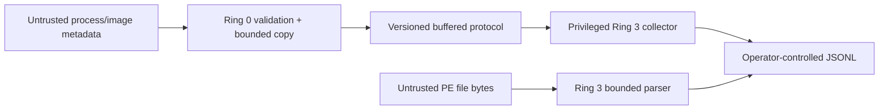
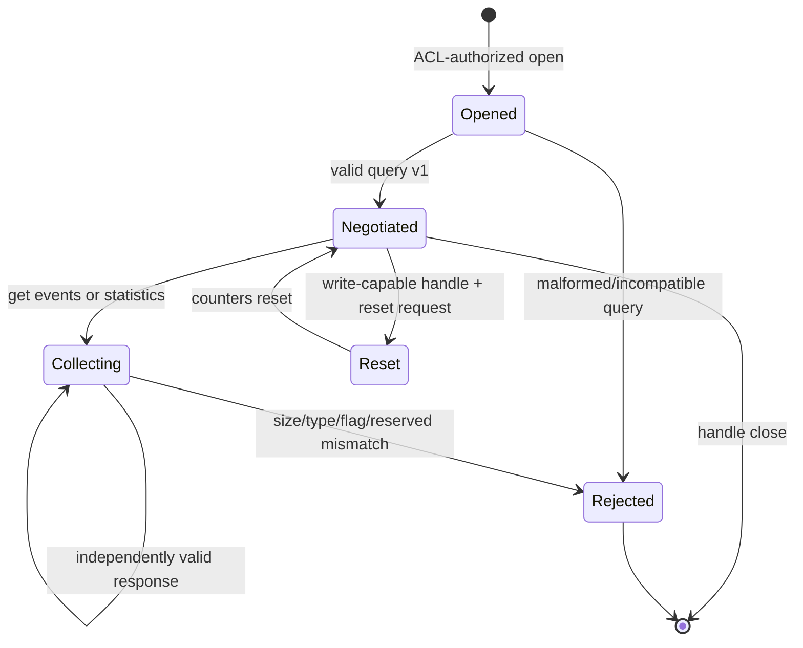

# Architecture and engineering model

## Trust boundaries

The kernel/user boundary is crossed only through the four IOCTLs in
`shared/Protocol.h`. The protocol has fixed-width integer fields, fixed arrays,
explicit `StructSize`, `ProtocolVersion`, `MessageType`, `Flags`, sequence and
correlation fields, and zero-required reserved fields. It contains no pointer,
handle, `size_t`, flexible array, native enum, bitfield, or architecture-sized
field. Compiler assertions freeze sizes and important offsets.

All IOCTLs use `METHOD_BUFFERED`. The I/O manager owns the system buffer;
KernelScope never receives a user pointer to dereference. Fixed responses require
exact input and output sizes. Batch output must equal `64 + MaximumEvents * 600`
bytes. On failure, the request completes with zero output bytes.

## Protocol state

The driver does not keep a negotiation state per handle; the collector enforces
the state machine and the driver validates every message independently. This
keeps kernel lifetime and locking small while avoiding trust in earlier calls.

## Ring buffer and sequence model

The ring owns 1,024 records allocated once from `NonPagedPoolNx` during device
initialization. Callbacks create a zero-initialized record on the kernel stack,
perform a capped UTF-16 copy, then take one WDF spin lock. Full-ring attempts
consume a sequence number and increment saturating total/pending drop counters;
therefore the next delivered record creates a detectable gap. When two slots are
available, a synthetic `KS_EVENT_DROPPED_STATISTICS` record is inserted before
the current record. Its `AuxiliaryValue` is the number of pending drops.

Sequence 0 is reserved. Sequence values never wrap: after the 64-bit counter is
exhausted, new records are rejected and counted as dropped. Statistics reset
does not reset the sequence, avoiding accidental non-monotonic streams.

## IRQL and synchronization

| Operation | Documented/required IRQL | Synchronization | Allocation |
| --- | --- | --- | --- |
| Driver/device initialization | `PASSIVE_LEVEL` | Framework serialization | One `NonPagedPoolNx` ring allocation |
| Process create/exit callback | `PASSIVE_LEVEL` | Bounded WDF spin-lock section | None |
| Image-load callback | `PASSIVE_LEVEL` | Bounded WDF spin-lock section | None |
| Ring push/pop/statistics | `<= DISPATCH_LEVEL` | Same WDF spin lock | None |
| IOCTL dispatch | `PASSIVE_LEVEL` in the default queue contract | Ring lock only for data snapshot/copy | None in driver code |
| Callback registration/removal | `PASSIVE_LEVEL` | Registration APIs synchronize removal | None |
| Ring cleanup | `PASSIVE_LEVEL` | Callbacks stopped, then ring lock | Secure zero + delete memory object |

The spin lock raises the caller to `DISPATCH_LEVEL`; paged code and pageable
data are not accessed while it is held. At most 64 fixed records are copied per
pop, so lock duration is bounded. No hashing, file access, trust lookup, PE
parsing, or serialization occurs at elevated IRQL or in Ring 0.

## Resource lifetimes

| Resource | Created | Parent/owner | Released |
| --- | --- | --- | --- |
| WDF driver | `DriverEntry` | I/O manager | Framework unload |
| Control device/context | `KsCreateControlDevice` | WDF driver | Framework/device deletion |
| Device name and DOS link | Device initialization | WDF device | Device deletion |
| Spin lock | Ring initialization | WDF device | Device deletion |
| Nonpaged ring memory | Ring initialization | WDF device | Explicit secure zero/delete; parent fallback |
| Process callback | Telemetry start | Driver registration | Telemetry stop before unload |
| Image callback | Telemetry start | Driver registration | Telemetry stop before unload |
| User handle | Collector open | `UniqueHandle` | RAII close |
| JSONL file | Collection command | `JsonWriter` | RAII close/flush |
| BCrypt handles | Hash operation | Hash function | Explicit destroy/close on every path |
| WinTrust state | Signature operation | Verification call | `WTD_STATEACTION_CLOSE` |

## Failure-mode analysis

| Failure | Behavior | Security property |
| --- | --- | --- |
| Device allocation/naming fails | Initialization aborts and WDF objects unwind | No partially usable interface |
| Ring allocation fails | Driver load fails; no callbacks are registered | Callback never targets absent storage |
| Process callback registration fails | Load fails | No silent loss of the required source |
| Image callback registration fails | Process callback is removed; load fails | Partial initialization is unwound |
| Ring full | Record is not stored; drop and sequence accounting saturate safely | No allocation or overwrite |
| Invalid IOCTL/buffer/header | `STATUS_INVALID_*`, zero information | No partial protocol output |
| Collector receives malformed response | Collection stops with protocol exit code | Kernel output is never blindly trusted |
| JSON rotation/write fails | Collection stops with I/O exit code | No false claim of persistence |
| PE range/RVA invalid | Finding or parse failure before dereference | No out-of-bounds access |
| Trust revocation unavailable | Separate unknown state | Inconclusive is not promoted to valid |
| Callback removal reports failure | Debug diagnostic; treated as a fatal engineering defect | Must be investigated before release |

## Image classification

System-mode images or images with a null process ID are classified as kernel
driver image loads. User images whose bounded path ends in `.exe`
case-insensitively are classified as executable images; other user images are
classified as DLL images. This documented-metadata heuristic avoids process
state tables and callback-time allocation, but file extensions can be absent or
misleading. Consumers must treat the type as telemetry classification, not a
security verdict.

